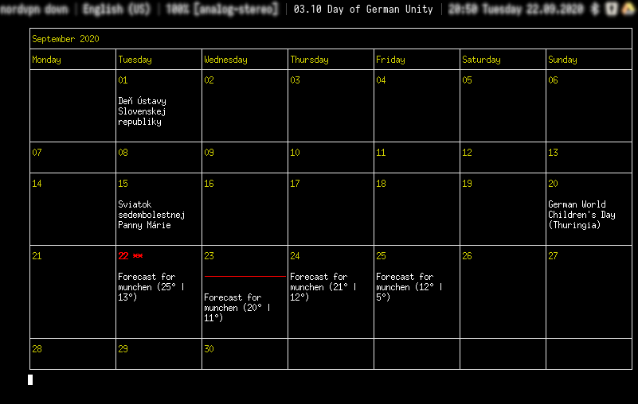

# i3blocks gcalcli

Block for [i3blocks](https://github.com/vivien/i3blocks) which shows upcoming event in the status bar and full month when clicked on.



## Dependencies
- python
- [gcalcli](https://github.com/insanum/gcalcli)
- [xterm](https://invisible-island.net/xterm/) - for showing calendar in popup window

## Installation
Install and setup gcalcli.

Setup popup window style and position in i3 config:
```
# i3blocks-gcalcli
for_window [class="XTerm" title="i3blocks-gcalcli"] floating enable
for_window [class="XTerm" title="i3blocks-gcalcli"] move absolute position 1665 25
for_window [class="XTerm" title="i3blocks-gcalcli"] border none
```

## Usage

```
$ ./i3blocks_gcalcli.py -h
Usage:
  i3blocks_gcalcli.py [options]

Options:
  -e, --eventCalendars          Event calendars are considered when getting next upcoming event. Probably weather calendar should be skipped. Multiple values comma separated.
  -m, --monthCalendars          Month calendars are considered when showing full month after click. Multiple values comma separated.
  -f, --fontFamily              Font family/face used for xterm window showing month calendar.
  -w, --width                   Cell width of month calendar. Minimum 10. Default 20.
  -s, --status                  Status format. Possible values: datetimetitle, datetitle, title. Default datetimetitle.
```

List blocklet configuration in i3blocks config:
```
[gcalcli]
command=i3blocks_gcalcli.py -e "Holidays in Germany" -m "weather,Holidays in Germany,Sviatky na Slovensku" 
interval=1800
```

